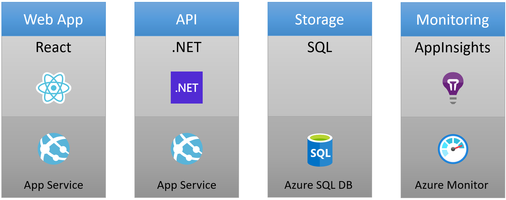

# To Do Application with C# and Azure SQL

This repo contains a complete sample To Do application that demonstrates how to build an Azure solution using C#, Azure SQL for storage, and Azure Monitor for monitoring and logging.

## ⛔ IMPORTANT

> ### Please keep all repositories and templates you create on GitHub.com _private_

## To Do Application

Here's the web frontend of this To Do application:


## Azure Resources

This application is comprised of the following Azure resources:

- Azure App Services - To host the To Do app website and API.
- Azure SQL - To store the To Do data in a database.
- Azure Monitor - A cloud instrumentation service to help you monitor your application.



## Setup

To run this project, you first need to setup your local development environment and get the code.

> NOTE: Support for GitHub Codespaces and VS Code Remote Containers (DevContainers) is coming soon.

### Prerequisites

Please install the following prerequisites on your local machine.

1. Install [Git](https://git-scm.com/)
1. Install [GitHub CLI](https://github.com/cli/cli)
1. Install [.NET SDK 6.0](https://dotnet.microsoft.com/en-us/download/dotnet/6.0)
1. Install [Node.js with npm (v 16.13.1 LTS)](https://nodejs.org/)
1. Install [Azure CLI (v 2.30.0+)](https://docs.microsoft.com/cli/azure/install-azure-cli)
1. Install Azure Dev CLI Extension

   This allows you to run all of the `az dev` commands that you will see below.

   Run this command to install it:

   ```bash
   az extension add --source https://azuresdkreleasepreview.blob.core.windows.net/azd/preview/0.0.1-beta/azure_dev-0.0.1b0-py3-none-any.whl -y
   ```

### Project Folder

You will need an empty folder on your computer to house the project files.

1. Open your favorite terminal, create a new folder, and set your current directory to that newly created folder.

   ```bash
   mkdir {your-unique-project-folder-name}
   cd {your-unique-project-folder-name}
   ```

## Quickstart

The fastest possible way for you to get this app up and running on Azure is to use the `az dev up` command.

The `az dev up` command will:

1. Provision all the Azure resources required by this application
2. Deploy the code you need to run the application

Run the following command to provision, build, and deploy this application to Azure in a single step.

```bash
az dev up --template todo-csharp-sql
```

> NOTE: This may take a while to complete as it performs both the `az dev provision` (creates Azure services) and `az dev deploy` (deploys code) steps.

This will print a URL to the To Do API application and a URL to the To Do web application. Click the web application URL to launch the To Do app.

Click the Azure Portal link to view resources provisioned.

## Commands

### Init

Run the following command to get a local copy of this repository:

```bash
az dev init --template todo-csharp-sql
```

### Provision

Before you can run this application, you will need to provision your resources to Azure.

Run the following command to provision your Azure resources.

```bash
az dev provision
```

### Deploy

Run the following command to deploy the application to Azure:

```bash
az dev deploy
```

### Monitor

To help with monitoring applications, the Azure Dev CLI provides a `monitor` command to help you get to the various Application Insights dashboards.

#### Overview Dashboard

Run the following command to open the "Overview" dashboard:

```bash
az dev monitor --overview
```

#### Live Metrics Dashboard

Run the following command to open the "Live Metrics" dashboard:

```bash
az dev monitor --live
```

#### Logs Dashboard

Run the following command to open the "Logs" dashboard:

```bash
az dev monitor --logs
```

### Clean up

#### Deprovision Azure Resources

Run the following command to delete the application from your Azure subscription.

```bash
az dev down
```

#### Remove the Azure Dev CLI extension

Run the following command to remove the Azure Dev CLI extension:

```bash
az extension remove --name azure-dev
```

### Pipelines

Coming soon...

### Run/Debug/Test

Coming soon...
